- 👋 Hi, I’m @slsevilla
- 👀 I’m interested in generating flexible, reproducible, workflows for next-generation sequencing data!
- 📫 You can reach me at: samantha.sevilla@nih.gov
- 🧬 You can find me on [LinkedIn](https://www.linkedin.com/in/samantha-chill-a1940524/)

#### GitHub Metrics

