## Samantha Sevilla Chill

#### About Me
- 👋 Hi, I’m @slsevilla
- 📖 I’m interested in generating flexible, reproducible, workflows for next-generation sequencing data
- 📫 You can reach me at  

#### GitHub Metrics

